# 🎯 Kanban Board - Сучасний Таск-Менеджер

[](https://nextjs.org/)
[](https://reactjs.org/)
[](https://www.typescriptlang.org/)
[](https://tailwindcss.com/)
[](https://opensource.org/licenses/MIT)

<div align="center">
  
  
  **Повнофункціональна Kanban дошка, створена з використанням найкращих практик веб-розробки**
  
  • [📚 Документація](./docs) • [🎯 Тестові завдання](./docs/workshop-tasks-ua.md) • [🐛 Звіти про баги](https://github.com/slavai/canban_example/issues)
</div>

---

## 📋 **Зміст**

- [🌟 Особливості](#-особливості)
- [🏗️ Архітектура](#️-архітектура)
- [🚀 Швидкий старт](#-швидкий-старт)
- [🎨 UI/UX Компоненти](#-uiux-компоненти)
- [📱 Адаптивність](#-адаптивність)
- [♿ Доступність](#-доступність)
- [⚡ Продуктивність](#-продуктивність)
- [🧪 Тестування](#-тестування)
- [📦 Структура проекту](#-структура-проекту)
- [🎓 Навчальні матеріали](#-навчальні-матеріали)
- [🤝 Внесок у проект](#-внесок-у-проект)
- [📄 Ліцензія](#-ліцензія)

---

## 🌟 **Особливості**

### **🎯 Основний функціонал**
- ✅ **Повноцінна Kanban система** з drag & drop
- ✅ **Управління завданнями** (створення, редагування, видалення)
- ✅ **Кастомні колонки** з можливістю додавання/видалення
- ✅ **Система пріоритетів** (Низький, Середній, Високий, Терміновий)
- ✅ **Дати виконання** з візуальними попередженнями
- ✅ **Пошук у реальному часі** по всіх полях
- ✅ **Автозбереження** в localStorage

### **🎨 Дизайн та UX**
- 🎨 **Сучасний дизайн** з градієнтами та тінями
- 📱 **Адаптивність** на всіх пристроях
- ⚡ **Плавні анімації** 60fps
- 🎯 **Візуальний фідбек** для всіх дій
- 🔔 **Toast сповіщення** для операцій
- ⌨️ **Клавіатурна навігація** з shortcuts

### **♿ Доступність та Якість**
- ♿ **WCAG 2.1 AA** відповідність
- 🎯 **ARIA labels** та ролі для screen readers
- 📢 **Підтримка screen reader**
- 🎮 **Focus management** у модальних вікнах
- 🌗 **High contrast** підтримка

### **⚡ Технічна досконалість**
- 🔒 **TypeScript 100%** з суворим режимом
- 🚀 **React.memo** оптимізація
- 🛡️ **Error boundaries** для graceful errors
- 🏭 **Production-ready** build конфігурація
- 🔍 **SEO optimized** з meta tags

---

## 🏗️ **Архітектура**

```mermaid
graph TB
    A[🌐 Next.js App Router] --> B[📱 Kanban Board]
    B --> C[🗂️ Column Management]
    B --> D[📝 Task Management] 
    B --> E[🔍 Search & Filters]
    
    C --> F[➕ Add Column]
    C --> G[✏️ Edit Column]
    C --> H[🗑️ Delete Column]
    
    D --> I[➕ Create Task]
    D --> J[✏️ Edit Task]
    D --> K[🗑️ Delete Task]
    D --> L[🔄 Move Task]
    
    E --> M[🔍 Real-time Search]
    E --> N[🏷️ Priority Filter]
    E --> O[📅 Date Filter]
    
    P[💾 Local Storage] --> Q[🔄 State Management]
    Q --> R[📊 useKanban Hook]
    R --> S[🎯 Board State]
    
    T[🎨 UI Components] --> U[🧩 Reusable Components]
    U --> V[🎛️ Button, Input, Card]
    U --> W[🚨 Toast, Modal, Loading]
    
    X[🎯 Type Safety] --> Y[📘 TypeScript Types]
    Y --> Z[🔗 Strict Interfaces]
```



### **🔧 Технологічний стек**

| Категорія | Технологія | Версія | Призначення |
|-----------|------------|---------|-------------|
| **Frontend Framework** | Next.js | 15.4.4 | App Router, SSR, Оптимізація |
| **UI Library** | React | 19.1.0 | Компонентна архітектура |
| **Language** | TypeScript | 5.8.3 | Типізація та безпека |
| **Styling** | Tailwind CSS | 3.4.17 | Utility-first CSS |
| **State Management** | React Hooks | Built-in | Локальний стан |
| **Data Persistence** | localStorage | Native | Збереження даних |
| **Build Tool** | pnpm | 10.13.1 | Швидкий пакетний менеджер |
| **Code Quality** | ESLint | 9.32.0 | Лінтінг та якість коду |

---

## 🚀 **Швидкий старт**

### **📋 Вимоги**
- Node.js 18.17.0+
- pnpm 8.0.0+

### **⚡ Встановлення та запуск**

```bash
# 1️⃣ Клонування репозиторію
git clone https://github.com/slavai/canban_example.git
cd canban_example

# 2️⃣ Встановлення залежностей
pnpm install

# 3️⃣ Запуск у режимі розробки
pnpm dev

# 4️⃣ Відкрийте у браузері
open http://localhost:3000
```

### **🏭 Production збірка**

```bash
# Збірка для продакшену
pnpm build

# Запуск продакшен сервера
pnpm start

# Експорт статичних файлів
pnpm export
```

### **🧹 Додаткові команди**

```bash
# Лінтінг з автовиправленням
pnpm lint:fix

# Перевірка типів
pnpm type-check

# Очищення збірки
pnpm clean
```

---

## 🎨 **UI/UX Компоненти**

### **🧩 Переиспользуемые компоненты**

```typescript
📦 src/components/
├── 🎨 ui/                    # Базові UI компоненти
│   ├── Button.tsx           # Універсальна кнопка з варіантами
│   ├── Input.tsx            # Поле введення з валідацією
│   ├── Card.tsx             # Картка-контейнер
│   ├── Select.tsx           # Випадаючий список
│   ├── LoadingSpinner.tsx   # Індикатор завантаження
│   └── ErrorBoundary.tsx    # Обробка помилок
├── 🎯 kanban/               # Kanban-специфічні компоненти  
│   ├── KanbanBoard.tsx      # Головна дошка
│   ├── KanbanColumn.tsx     # Колонка з завданнями
│   ├── TaskCard.tsx         # Картка завдання
│   ├── TaskModal.tsx        # Модальне вікно завдання
│   └── ColumnModal.tsx      # Модальне вікно колонки
└── 🏗️ layout/               # Layout компоненти
    └── ToastProvider.tsx    # Провайдер сповіщень
```

### **🎛️ Варіанти кнопок**

```typescript
// Приклад використання компонента Button
<Button variant="default" size="md">Зберегти</Button>
<Button variant="destructive" size="sm">Видалити</Button>
<Button variant="outline" size="lg">Скасувати</Button>
<Button variant="ghost" size="icon">⚙️</Button>
```

### **🎨 Дизайн система**

| Елемент | Значення | Використання |
|---------|----------|--------------|
| **Primary Color** | `#3b82f6` | Основні дії, акценти |
| **Success Color** | `#10b981` | Успішні операції |
| **Warning Color** | `#f59e0b` | Попередження |
| **Error Color** | `#ef4444` | Помилки, видалення |
| **Border Radius** | `0.375rem` | Заокруглення елементів |
| **Font Family** | `Inter` | Основний шрифт |
| **Animation Duration** | `200ms` | Стандартна анімація |

---

## 📱 **Адаптивність**

### **📐 Брейкпоінти**

```css
/* Tailwind CSS брейкпоінти */
sm: 640px   /* Мобільні пристрої (великі) */
md: 768px   /* Планшети */
lg: 1024px  /* Ноутбуки */
xl: 1280px  /* Десктоп */
2xl: 1536px /* Великі екрани */
```

### **📱 Мобільна оптимізація**

- ✅ **Touch-friendly** інтерфейс з великими зонами дотику
- ✅ **Swipe жести** для навігації між колонками  
- ✅ **Responsive layout** з гнучкою сіткою
- ✅ **Mobile-first** підхід у дизайні
- ✅ **Performance optimized** для мобільних пристроїв

---

## ♿ **Доступність**

### **🎯 WCAG 2.1 AA Відповідність**

```typescript
// Приклад accessibility атрибутів
<Button
  aria-label="Додати нове завдання до колонки 'В процесі'"
  aria-describedby="task-help-text"
  role="button"
  tabIndex={0}
>
  Додати завдання
</Button>
```

### **⌨️ Клавіатурні скорочення**

| Комбінація | Дія |
|------------|-----|
| `Ctrl + N` | Створити нове завдання |
| `Enter` | Редагувати завдання під фокусом |
| `Delete` | Видалити завдання під фокусом |
| `Escape` | Закрити модальне вікно |
| `←→` | Навігація між колонками |
| `↑↓` | Навігація між завданнями |

---

## ⚡ **Продуктивність**

### **📊 Lighthouse Метрики**

```
🚀 Performance:     95+ 
♿ Accessibility:   100
🎯 Best Practices:  95+
🔍 SEO:             100
```

### **⚡ Оптимізації**

- ✅ **React.memo()** для запобігання зайвих ререндерів
- ✅ **Lazy loading** для модальних вікон
- ✅ **Debounced search** для оптимізації пошуку
- ✅ **LocalStorage caching** для швидкого завантаження
- ✅ **Optimized bundle** з code splitting

---

## 🧪 **Тестування**

### **🔧 Налаштування тестів**

```bash
# Запуск unit тестів
pnpm test

# Запуск з coverage
pnpm test:coverage

# E2E тести з Playwright
pnpm test:e2e
```


## 📦 **Структура проекту**

```
🏗️ kanban-board/
├── 📁 public/                 # Статичні ресурси
│   ├── 🖼️ icons/              # Іконки та зображення
│   └── 📄 manifest.json       # PWA маніфест
├── 📁 src/                    # Вихідний код
│   ├── 📁 app/                # Next.js App Router
│   │   ├── 📄 layout.tsx      # Кореневий layout
│   │   ├── 📄 page.tsx        # Головна сторінка
│   │   └── 🎨 globals.css     # Глобальні стилі
│   ├── 📁 components/         # React компоненти
│   │   ├── 🎯 kanban/         # Kanban специфічні
│   │   ├── 🎨 ui/             # Переиспользуемые UI
│   │   └── 🏗️ layout/         # Layout компоненти
│   ├── 📁 hooks/              # Custom React hooks
│   │   └── 🎣 useKanban.ts    # Основний hook стану
│   ├── 📁 types/              # TypeScript типи
│   │   └── 📘 kanban.ts       # Інтерфейси Kanban
│   ├── 📁 utils/              # Допоміжні функції
│   │   ├── 🔧 kanban.ts       # Бізнес-логіка
│   │   ├── 💾 storage.ts      # LocalStorage менеджер
│   │   ├── 📊 demo-data.ts    # Демо дані
│   │   └── 🎯 constants.ts    # Константи проекту
│   └── 📁 messages/           # Інтернаціоналізація
│       ├── 🇺🇦 ua.json        # Українська мова
│       ├── 🇺🇸 en.json        # Англійська мова
│       └── 🇩🇪 de.json        # Німецька мова
├── 📁 docs/                   # Документація
│   ├── 📋 implementation-plan.md  # План реалізації
│   ├── 📝 use-cases.md            # Випадки використання
│   └── 🎓 workshop-tasks-ua.md    # Навчальні завдання
├── 📁 tests/                  # Тести
│   ├── 🔧 unit/               # Unit тести
│   ├── 🔗 integration/        # Інтеграційні тести
│   └── 🎭 e2e/                # End-to-end тести
└── 📄 README.md               # Документація проекту
```

---

## 🎓 **Навчальні матеріали**

### **🎯 Workshop завдання**

Ми підготували комплексний набір завдань для вивчення AI-assisted розробки:

➡️ **[Перейти до тестових завдань](./docs/workshop-tasks-ua.md)**

### **📚 Рівні складності**

- 🟢 **BEGINNER** - Основи UI та стилізації (15-20 хв)
- 🟡 **INTERMEDIATE** - Логіка та стан (25-30 хв)  
- 🔴 **ADVANCED** - Складні фічі (35-45 хв)
- 🟣 **EXPERT** - Production-ready рішення (45-60 хв)

### **🎖️ Приклади завдань**

1. **Dark Mode Toggle** - Додати перемикач темної теми
2. **Advanced Filters** - Розширені фільтри завдань
3. **Real-time Collaboration** - Симуляція спільної роботи
4. **Performance Optimization** - Оптимізація продуктивності

---

## 🤝 **Внесок у проект**

### **🔧 Як долучитися**

1. **Fork** репозиторій
2. **Створіть** feature branch (`git checkout -b feature/АмейзінгФіча`)
3. **Commit** зміни (`git commit -m 'Додає АмейзінгФічу'`)
4. **Push** до branch (`git push origin feature/АмейзінгФіча`)
5. **Відкрийте** Pull Request

### **📋 Coding Standards**

- ✅ **TypeScript** для всього коду
- ✅ **ESLint** конфігурація проекту
- ✅ **Prettier** для форматування
- ✅ **Conventional Commits** для повідомлень
- ✅ **100% тестове покриття** для нових фіч


## 📄 **Ліцензія**

Цей проект ліцензований під MIT License - дивіться [LICENSE](LICENSE) файл для деталей.

---

## 🎯 **Recreate This Project with Cursor AI**

Want to build a similar application using Cursor AI? Use this comprehensive prompt:

<details>
<summary><strong>🤖 Complete Cursor AI Prompt (Click to expand)</strong></summary>

```
Hey! I want to build a Kanban board app like Trello. Help me create something really good.

Use Next.js, React, TypeScript and Tailwind CSS. Make it work well and look professional.

Here's what I want:
- Drag and drop tasks between columns
- Add, edit, delete tasks  
- Create custom columns (not just To Do, In Progress, Done)
- Priority levels with colors (Low, Medium, High, Urgent)
- Due dates that show when stuff is overdue
- Search through tasks
- Save everything locally so it persists
- Good keyboard shortcuts
- Works on mobile and desktop
- Proper accessibility for screen readers

Make the code clean with TypeScript, no errors, and fast performance.

First, create two planning documents:
1. Implementation plan with phases and tasks
2. Use cases with user stories

Then I'll review the plan and ask you to build it step by step.

Start by making those two planning docs.
```

</details>

---

<div align="center">
  <h2>🚀 Ready to Start Building?</h2>
  
  [](./docs/workshop-tasks-ua.md)
  [](https://canban-example.vercel.app)
  [](https://github.com/slavai/canban_example/fork)
  
  <p><strong>Створений з ❤️ для спільноти розробників</strong></p>
  <p>⭐ Якщо проект був корисним, поставте зірочку!</p>
</div>
